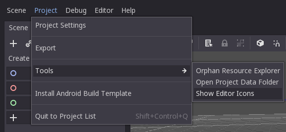
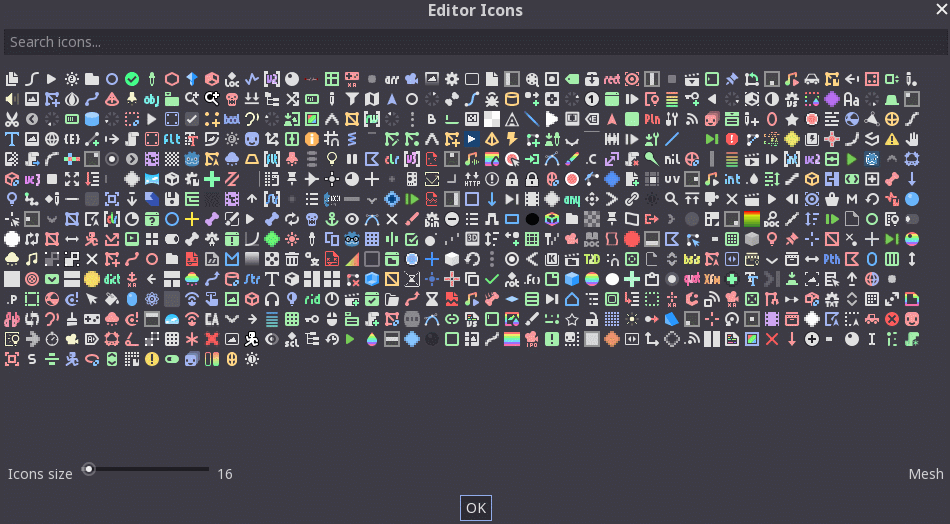

# Godot Editor Icons Previewer

Godot plugin which adds ability to preview all available icons in Godot Editor.
Can be used to help developing Godot plugins without the need to import custom icons.

## Compatibility

Godot 3.1+ compatible.

## Usage

Navigate to `Project` → `Tools` and click `Show Editor Icons` menu option:

A window shall popup listing all available editor icons which Godot uses natively
(can also show icons from any custom C++ module):

Hovering on icons will show their internal name to be used when developing plugins. 
See [editor_plugin_utils.gd](addons/editor_icon_previewer/editor_plugin_utils.gd) 
on how to fetch such icon.
